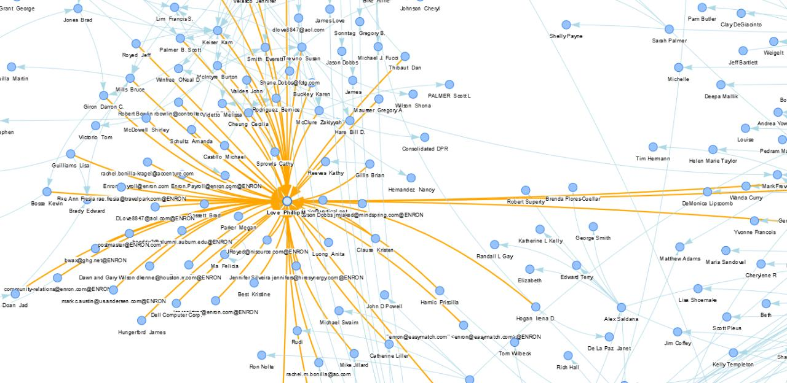

# MailViz
> An Email Visualization and Analytics Platform

## Philosophy

Viz is a project in electronic discovery that takes a database of emails and renders it in a [network graph](https://brilliant.org/wiki/social-networks/#:~:text=A%20social%20network%20graph%20is,be%20either%20undirected%20or%20directed.) of email communications between users. 

It is an Email Network Database Visualization and Analysis platform that is capable of rendering thousands, if not hundreds of thousands of emails. Each node in the graph represents person in the social network and the size of connections between the nodes (edges) is relative to the number of emails exchanged between the users. Each node can be expanded to view all the emails sent by the user, or interactions between a set group of users. Several advanced filters can be applied to identify and search for various types of emails you might be looking for.

For example, you can search for emails specific with the word "hello" in the subject and layer it with AND / OR / NOT filters where the sender is "John" OR "Nancy", and recipient is "Jimmy" AND "Lucy". This filter will give you a visualization of all emails that were sent by either "John" or "Nancy" to "Jimmy" or "Lucy" with the word "hello" in the subject.

Upon expanding a particular view or applying some filters, the platform also gives you the ability to preview the data and export it into various formats like `.csv` or `.json`, and also does automated data analysis on that data giving the "Time of Day" or "Day of Week" those filtered emails were sent. 

The Graph, colors and sizes of the nodes and edges are easily configurable with a file called `config.json`.

## Examples


*Figure 1: Expanded View of Nodes*


*Figure 2: Zoomed View of Nodes*


*Figure 3: Details Pane*

## Running

Firstly I would recommend you read and familiarize yourself with Carnegie Mellon University's Enron Emails Database available [here](https://www.cs.cmu.edu/~./enron/). The database schema for the project is derived from the Enron database and further documentation is available in the respective main files for both the backend and the frontend. 

Here are the setup instructions for each of the components of the project:

### Backend 
`ASP.NET Web Framework 2018`

1. Installing Visual Studio
2. Install ASP.NET Web Framework (not Core)
3. Load the directory `backend/EmailServicesAPI/backend` as a .NET Web Framework REST API Application. 
4. Install LINQ
5. Install other requirements

### Database
`Microsoft SQL Server 2018`

1. Import the Database Schema from the Enron Emails Database

### Frontend
`Angular 8`

Make sure you have node, and npm installed then simply write:

```bash
npm i 
npm start 
```

## Contributing

* If you would like to make a feature request: Make an Issue tagged as `enhancement`
* If you encounter any bugs or errors: Make an Issue tagged as `bug`
* If you would like to make your own commits, Branch, Commit and Make a pull request! 

## License 

GNU GPLv3 
